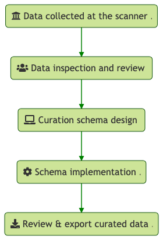

# Introduction

Data curation in the field of neuroimaging is a fundamental task necessary for
creating scalable, reproducible science. As the volume, velocity, and variety of
these data sets increases and requires greater computational efficiency and
expertise, many researchers have opted to have their data hosted by private
vendors whose infrastructure may mitigate some of the challenges of storing,
organising, and curating massive amounts of data. One such vendor, Flywheel,
provides many solutions for these challenges.
However, as the scientific landscape expands, researchers
ultimately must be able to curate their data themselves on a case-by-case basis
to meet novel scientific standards. Additionally, cases inevitably arise in
which boilerplate curation tools are unable to correctly curate legacy data,
leading to the need for either tedious and error-prone manual curation, or the
need for highly skilled programmers and engineers to assist in automated
curation.
Efforts to formalize the curation of data in neuroimaging include
the Brain Imaging Data Structure (BIDS), an open-source
specification on how to store and share neuroimaging files. This specification
is in continuous development with input from the community, and provides a
flexible framework for the development of software pipelines and applications.
Flywheel allows users to curate their data using BIDS, but lacks sufficient
flexibility for the large variety of use-cases in neuroimaging data warehousing.

This increasing ubiquity and usefulness of BIDS-valid data sets motivated the
development of FlywheelTools, a multi-purpose toolkit for interacting with and
curating data on the Flywheel platform to meet BIDS standards.


# Methods

The FlywheelTools toolkit allows users to follow a reproducible
workflow for BIDS curation and audit of their data. This workflow typically
includes: inspection of sequences collected during a study; design of a
curation schema; implementation of curation schema;
curated data inspection and export; and finally audit of data and analyses (see
figure \ref{main_workflow}).



## Programming Languages & Technologies

Flywheel Tools is built primarily in Python 3.6 [@10.5555/1593511] in order to
leverage its highly accessible SDK. Additionally, R 3.4.1 [@Rversion] is used
for HTML report generation. For reproducibility and workflow management,
Flywheel Tools' modules are packaged in version-controlled software containers
built and managed in Docker [@10.5555/2600239.2600241].
Lastly, the Flywheel Tools package relies on users adopting the Brain Imaging
Data Structure (BIDS) to curate their data. BIDS has rapidly evolved to become
the field standard directory standard in the neuroimaging community for
reproducible data organization [@gorgolewski2016brain]. Importantly, BIDS has a large
community of participants contributing to its development and adoption, and
proposals for BIDS schema go through rigorous community testing and approval
before being added. This leads to a trustworthy common framework for data
curation shared amongst researchers. Software developers leverage this ubiquity
by creating analysis and processing pipelines that can operate directly on BIDS
data sets as inputs, enhancing reproducibility and interoperability on various
software platforms.

## Flywheel

Flywheel is a data management and analysis platform for research, which
lends itself well to neuroimaging. The platform focuses heavily on collaborative
and reproducible science. User-facing components of the platform itself are the
Web User Interface (UI), the Software Development Kit (SDK), and the Application
Programming Interface (API) ([IMAGE HERE]()).

### Flywheel Web UI

The web UI is accessible through any modern web browser and is the primary
method of interacting with Flywheel data. Through this point-and-click
interface, users are able to upload, view, download, and analyse data with ease
and simplicity. However, accomplishing tasks with many repetitive steps or a
large number of subjects/sessions to iterate over can be tiresome and
error-prone. Alongside knowledge of navigating the web UI, many users also make
use of the SDK to manipulate and analyse data programmatically.

### Flywheel API & SDK

Flywheel's database utilises MongoDB for data storage and access, meaning that
all Flywheel data is represented by hierarchical relationships between document
objects. This allows users to create and store complex structures with
ease, and query data rapidly [@10.5555/2207997]. In order to access this data,
Flywheel uses a RESTful Application Programming Interface (REpresentational
State Transfer) [@biehl2016restful], and hence each document or data object is
accessible through a a specific URL that a web browser or SDK can access by
requesting the data and waiting for a response from the server. The Flywheel
Python SDK provides a powerful interface for inspecting and manipulating data
through this API. By standardising this underlying data model into Pythonic
Objects, the flywheel SDK is effectively an object relationship
mapper (ORM), similar to the popular SQLAlchemy software.

### Flywheel Data Model

Objects in Flywheel's data model follow a specific hierarchical
structure **([IMAGE]())** — at the top level is the FlyWheel *instance*, a
process running that serves the API to users (for example, a neuroimaging
center). Within the FlyWheel instance, there are multiple *groups*, which
are typically labs or research units that collaborate on one or more
*projects*. Each project object can have one or many *subjects* (i.e.
participants), and each subject can have one or many *sessions* (i.e. scanning
visits). Within a session, there may be one or many *acquisition* objects which
represent the scanning sequence collected during a particular scan or
examination (e.g. rs-fMRI, DWI, PET), and under each acquisition is *attached*
the data file associated with the sequence (e.g. a NIfTI file or DICOM).
Note that a file can be attached to any object type, and each object can have
metadata associated with it. Hence, a subject object may have de-identified
demographic metadata associated to that participant, and the subject may also
have a text file attached to it (such as clinical data). A notable exception to
the hierarchical structure rule is the analysis object, which behaves in much
the same way as others but can be a child object of any other object, allowing
researchers to create analyses of entire projects, for example, each with their
own associated metadata and files (such as inputs and outputs).

Abstracting this data model in Python results in simple hierarchical objects,
each with methods for handling metadata and files, and methods for
accomplishing object-specific tasks like traversing the hierarchical structure
or running analyses. Flywheel Tools' modules make use of this data model to
accomplish a wide range of tasks.

### Flywheel Gears

Flywheel encourages the use of pre-packaged computational workflows, called
*gears*. Gears are run by virtual machines/containers using Docker and hence are
version-controlled and software/platform agnostic. Gears can
accomplish tasks such as data manipulation, pre-processing, analysis, and
summarisation. In addition to the multitude of gears available on the platform,
users are able to package their own software in a gear and use it for running
analysis workflows on their Flywheel data, via the web UI or SDK. the complexity
and frequency of the task suggests whether to accomplish a task using the web
UI, programmatically using the SDK, or by wrapping it as a workflow into a gear,
depends on  **[IMAGE]()**. Gears can take existing Flywheel data, such
as images or file attachments, as inputs to the workflow, and can be created
with clickable configuration options. Once a workflow has completed running,
Flywheel collects any files remaining in the container's pre-defined output
directory and attaches them to a resulting analysis object. The resultant files
of a gear (such as an HTML report or tabulated data) can be viewed on the
Flywheel UI, downloaded to disk for further data sharing or analysis, or be used
as input to a subsequent gear themselves.

# Results

Flywheel Tools is implemented using the Flywheel SDK to enable easy
inspection, curation, validation, and audit of Flywheel data through a handful
of user-friendly gears and command-line interfaces.

The first module of the package is called `fw-heudiconv`, and is largely
inspired by the popular HeuDiConv Python package [^1]. `fw-heudiconv` is
a multi-part toolbox for reprodicible curation of neuroimaging data into BIDS on
Flywheel. The second module, `flaudit`, is a tool for accomplishing a complete
audit of a Flywheel project, giving users a broad overview of the key elements
of their data set.

## `fw-heudiconv`

The first tool, `fw-heudiconv`, is a multi-purpose command-line interface and
Flywheel gear designed for comprehensive BIDS curation on Flywheel. It is
designed to be intuitive, flexible, and reproducible.

### Architecture & Design

`fw-heudiconv` is inspired in large part by the Heuristic Dicom Converter
(HeuDiConv) package, and shares much of its design practices. In order to curate
data into BIDS, `fw-heudiconv` first considers Dicom data to be the "ground
truth" data, and builds its curation approach using data in the Dicoms' headers.
Ultimately, `fw-heudiconv` only has permission to manipulate metadata attached
to NIfTI files, in the "Info: BIDS" field, which ensures that curation can be
repeated from the stage of Dicom ingress reliably and safely.

`fw-heudiconv` can be downloaded as a Python command-line interface from the
Python Package Index using `pip`, and is available as a point-and-clickable gear
on the Flywheel UI. The gear is managed by Docker containerisation, meaning that
versioning is reliable and reproducible. There are a number of commands
available in `fw-heudiconv`, and each of them starts by querying data from
Flywheel. Users can filter their queries, so as to operate on an entire Flywheel
project, a subset of subjects, or a subset of sessions. Notably each command has the
ability to safely test and evaluate its effects without manipulating metadata on
Flywheel or writing data to disk. In particular, there are five commands users
can access:

#### 1. `fw-heudiconv-tabulate`

The tabulate tool is used to parse and extract DICOM header information in a
project (or within a filtered subset of that project) and tabulate this data for
the user to examine with ease. By collecting DICOM header information into
tabular format, the tabulate tool gives users a comprehensive overview of the
different scanning sequences that have been collected in the query, including
their sequence parameters. Additionally, users have the option to
limit the tabulation to a unique combination of common DICOM header fields,
which significantly decreases complexity of the table. The table output by this
command can be written to a local disk if run from the command line, or is saved
in the output section of a Flywheel gear if run on Flywheel.

#### 2. `fw-heudiconv-curate`

The curate tool is used to curate a dataset on Flywheel into BIDS format.
Much like HeuDiConv, curation is done through the use of a heuristic, a Python
file which programmatically defines the templates of a range of BIDS valid
filenames, and defines the boolean logic that would assign a given scanning
sequence to each template. This boolean logic is based on the sequence
information users find in the tabulation of sequences, and all fields available
in the Dicom header can be used to parse out which template a particular file
can be assigned to. Additionally, the curate tool can be used to manipulate BIDS
metadata that may need to be added to the dataset. The process of curation only
manipulates BIDS metadata of NIfTI files, and hence can be repeated or updated
at any time at the user's discretion.

#### 3. `fw-heudiconv-export`

The export tool is used to export a BIDS dataset on Flywheel to disk. The tool
is primarily used as a helper tool for other gears and scripts to quickly and
easily extract their BIDS data into the workspace of their analysis pipeline, or
by individuals who need their BIDS data exported from Flywheel.

#### 4. `fw-heudiconv-validate`

The validate tool is a wrapper around the popular BIDS Validator package
**[CITE]()** and is use to check if the applied curation results in a BIDS-valid
dataset. After exporting a data set with `fw-heudiconv-export`, the validate
tool runs the BIDS validator on the dataset and returns the result and verbose
description of the errors and warnings given by the BIDS Validator.

#### 5. `fw-heudiconv-clear`

The clear tool is used to clear BIDS information cleanly and safely from the
project or subjects and sessions queried. This can be useful when overwriting by
re-curating current BIDS data doesn't fully erase existing data.

### Heuristic File

The heuristic file is a Python file used as input to the `fw-heudiconv-curate`
command. It instructs `fw-heudiconv` how to programmatically sort and parse
through each acquisition object in Flywheel, and assign it to a BIDS-valid
naming template. This is done by checking attributes of a list of `seqInfo`
objects — generated from each DICOM's header information — against user-defined
boolean rules. For example, if a T1-weighted image is present in a dataset, the
user could define a string with a BIDS-valid naming template for this type of
file, such as:

```
t1w = 'subject-{SubjectLabel}_session-{SessionLabel}_T1w.nii.gz'
```

Where the `SubjectLabel` and `SessionLabel` portions are expected to be
automatically generated for each subject and session. After a DICOM's
`SeriesDescription` field is added to the `seqInfo`'s `SeriesDescription`
attribute, the user can create simple boolean rules to check if the string 'T1w'
is in the `SeriesDescription`. If such a rule is met, this acquisition and its
NIfTI file will be assigned to the T1-weighted image naming template. The NIfTI
file will ultimately have this BIDS naming added to its metadata, and be named
correctly when exported to a filesystem.

In addition to setting naming templates, the heuristic file can also be used to
hardcode and assign metadata in BIDS. These data are hard-coded into the file
object's metadata on Flywheel, and are assigned by using specially reserved
functions and keywords in `fw-heudiconv`. For example, the heuristic file can
be used to point fieldmap scans to their intended sequences using a list:

```
IntendedFor = {

  fieldmap1: ['sub-{SubjectLabel}_{SessionLabel}_task-rest_bold.nii.gz']

}`
```

By reserving select keywords for functions and metadata, heuristic files become
versatile tools for defining and manipulating a wide array of metadata in
Flywheel BIDS curation.

### Curation Workflow

For most users, the curation workflow follows the sequence detailed above; after
ingress of a batch of DICOMs from a scan, Flywheel's automated utility gears
convert the DICOMs to NIfTI files. Users can then begin running
`fw-heudiconv-tabulate` to gather the information stored in the DICOM headers
necessary for creating a heuristic. Once the tabulation has been completed, the
output file can be opened by any program that can read tabular data. Users at
this stage can begin creating a heuristic file and running
`fw-heudiconv-curate`, using the `--dry-run` flag to test the heuristic changes
incrementally with informative logging. When satisfied, users can simply remove
the `--dry-run` flag to apply the changes. The user can then use
`fw-heudiconv-validate` to run the BIDS validator on the dataset, or start over
by removing all BIDS metadata with `fw-heudiconv-clear`.


Additionally, if being run on the Flywheel UI, each of the commands is available
as a Flywheel gear. This option can be beneficial for data provenance as all of
a gear's commands and inputs, as well as outputs and log files, are stored and
attached to each gear run.

## `flaudit`

The second module is a Flywheel project auditor, aptly named `flaudit`. The
module is intended to give Flywheel users a broad overview of their
entire Flywheel project. Features of this overview include a comprehensive
visualization of scanning sequences and their parameters; the corresponding BIDS
curated result of each sequence; an enumeration of gear analyses and their
runtimes and success rates; and a visualization of the various analysis
workflows run on each session **[IMAGE]()**. This information is compiled in a
portable HTML report that can be opened in the Flywheel UI or in any web
browser.

### Architecture & Design

Using similar internal machinery to `fw-heudiconv-tabulate`, `flaudit` loops
over existing data in a project and tabulates information about scanning
sequences, BIDS metadata, and gear jobs that have been run. These 3 tables are
saved internally and then passed as input to an R markdown script that generates
a dynamic HTML report. The data are also saved as output for
the user to access and analyse at their own discretion.

# Discussion

As the neuroimaging community embraces Big Data and the various platforms
available for storage and analysis, it is becoming increasingly important for
researchers to eschew the *ad hoc* analysis procedures previously run on a
single machine or cluster. Instead, cloud-based platforms like Flywheel provide
opportunities for more reproducible, reliable, and shareable science. Flywheel
Tools provides software that maximizes these opportunities on the Flywheel
platform.

\newpage

# Bibliography

[^1]: https://github.com/nipy/heudiconv
