# Figure Generation

Figures and flowcharts are generated by
[Mermaid](https://mermaid-js.github.io/mermaid/#/) and the Mermaid CLI.

The workflow includes first generating and testing Mermaid figures in Atom using the `atom-mermaid` or `markdown-preview-enhanced` packages, and when ready, generating an SVG using a command like `mmdc -i figures/test.mmd -o figures/test.svg`

Then the image is included in markdown as normal:

Version controlled charts made with markdown-ish syntax?! Pretty cool!
